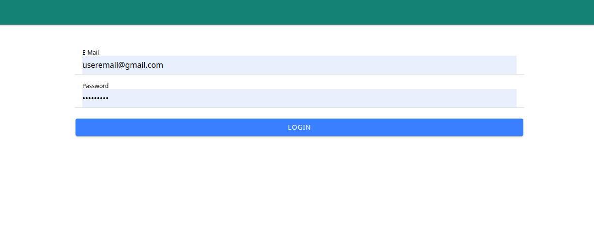
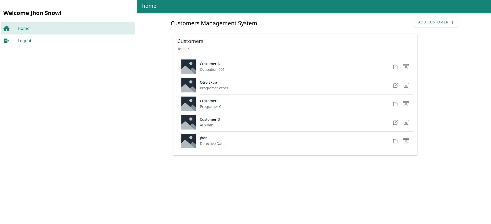
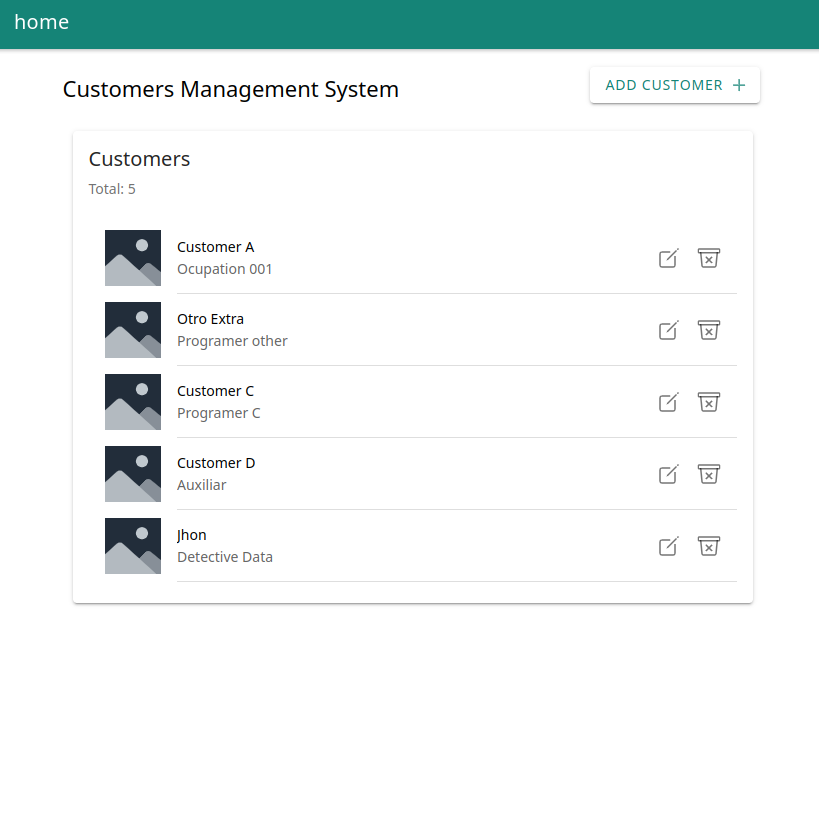
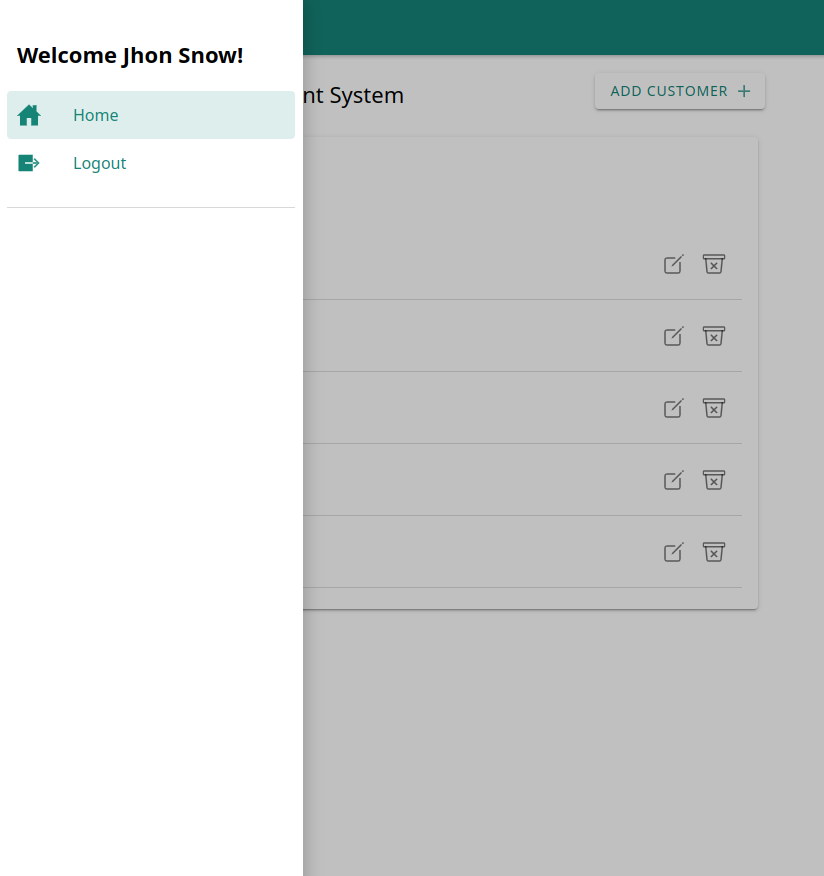
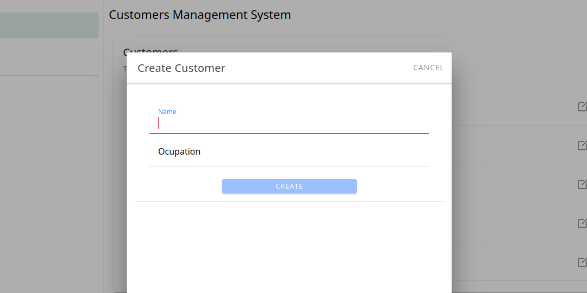
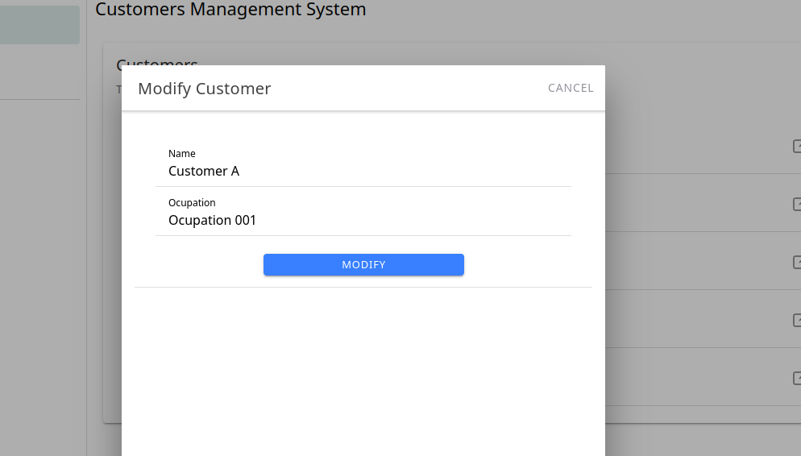

# Ionic 6 + Angular --- CRUD Example with Fake login

## Fake Credentials

```
    email: "useremail@gmail.com",
    password: "Passw123*"
```

## EXAMPLE DEMO APP

<p align="center">
 
 
 
 


<p>
